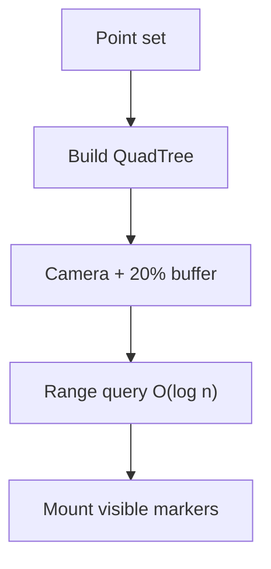

## Problem

The manager-dashboard map plotted thousands of robots, stations, and inventory points. React mounted a marker for every point. First paint was slow. Pan and zoom were worse: every camera change still walked the whole warehouse, including empty aisles the operator could not see.

## Approach

I indexed the floor with a QuadTree (capacity 4) so dense clusters subdivide and empty space stays coarse. The tree builds when the point set changes. Each pan or zoom queries the current viewport plus a 20% buffer, and React mounts only that hit list.

A public visualizer of the same algorithm lets you bypass the tree: 10,000 elements drop to about 5–15 FPS without it and hold 60 FPS with it. Full write-up: [Keeping a dashboard fast with a QuadTree](/writing/quadtree-performance).

## Outcome

Load time and interaction cost on the dashboard improved by 5×. The map opened, and dragging it did not freeze the rest of the UI. The manager dashboard work sat alongside a 30% improvement in warehouse oversight and a 10% increase in revenue from the broader feature set, and backend work on the same product line cut server response time by 40%.

## Tech

React, JavaScript, and a QuadTree spatial index with viewport culling.
