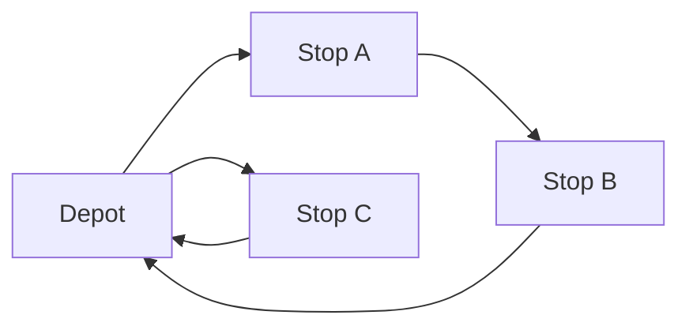
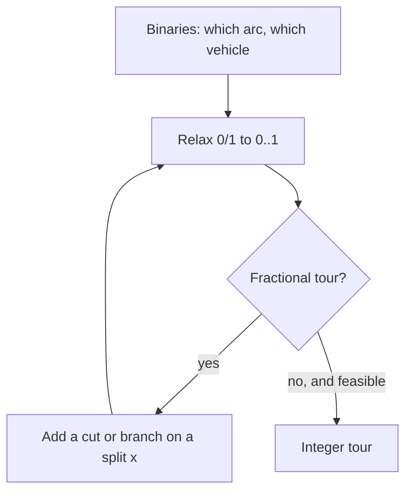
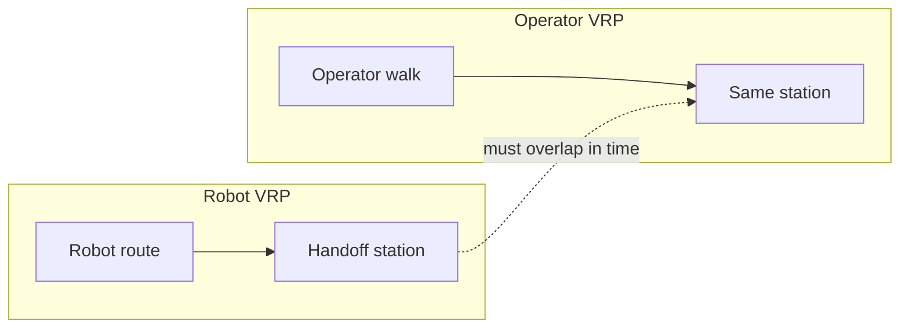

The case study is under Work: [Operator assignment](/work/operator-assignment).

## Problem

Warehouse robots and the people who serve them were planned as two queues. A robot finished a move and waited. An operator walked to a station that no longer needed them. Idle time was not a staffing problem first — it was an assignment problem that looked like vehicle routing and then refused to stay that small. Independent assignment stacked idle time, and service levels slipped when a human was not where a robot needed them.

## Approach

I started from a textbook vehicle routing MILP — binaries on arcs, a linear travel cost, cover and flow constraints — then grew it until the model had two fleets that must meet. Robots and operators are not interchangeable vehicles. A feasible solution is a pair of tours plus synchronization: the person and the machine occupy the same station in the same window, with skills and walk times intact.

I compared heuristics, constraint solvers, and a custom search against production-scale logs.

### A VRP you can hold in your head

Start with one depot, one vehicle, and three stops. The vehicle must leave the depot, visit every stop once, and come back. The only decision that matters is the *order*. That is a travelling salesman problem. Add a second vehicle and a rule that each stop is served by exactly one of them, and you have the smallest honest vehicle routing problem (VRP):

Two vehicles, three stops, one depot. Vehicle 1 takes A then B. Vehicle 2 takes C. Cost is walking or driving time on the chosen arcs. Nothing here is exotic. The hardness is already combinatorial: who takes which stop, and in what sequence.

If you only needed to *match* stops to vehicles and the order was fixed, this would be an assignment problem. Routing makes the match and the tour one object. That is the move the warehouse version inherits, then doubles.

### How a MILP says the same thing

A mixed-integer linear program does not search tours by name. It names numbers, asks for a linear cost, and forbids anything that is not a feasible routing with linear (in)equalities.

For that tiny VRP the usual encoding is:

- A binary \(x_{ijv}\): vehicle \(v\) travels directly from \(i\) to \(j\).
- Sometimes an integer or continuous load, time, or position variable so the solver can keep a tour from breaking into disconnected subtours.

The objective is linear: sum of travel times on the arcs you turn on.

The constraints are linear too, and that is the whole trick:

1. **Cover.** Each stop is entered once, left once.
2. **Flow.** If a vehicle arrives at a stop, it leaves. Vehicles that start at the depot return to it.
3. **Fleet.** Only \(k\) vehicles leave the depot.
4. **No subtours.** A set of stops cannot form a private loop that never touches the depot. MTZ potential variables, or an exponential family of cut constraints the solver adds when it sees a disconnected loop, both do this job.

The linear relaxation pretends you can send *half* a vehicle down an aisle. That fractional solution is a lower bound: no real tour can be cheaper than a world where you are allowed to split vehicles. Branch-and-cut then forces binaries back to 0 or 1, adding cuts when the relaxation still contains a sneaky subtour. When the bound and a feasible integer tour meet, you have a proved optimum for *that* model.

OptaPlanner is this search plus a lot of engineering on top of a Spring Boot service: construction heuristics to get a feasible tour, local search to move it, and a score that encodes the same linear costs and hard constraints. A MIP bound is still what tells you how far a runnable solution sits from the theoretical best.

On three stops and two vehicles the model is a classroom slide. The warehouse is the same slide after someone keeps adding columns.

### Explode the scale

Give each vehicle a capacity and each stop a demand, and you have a capacitated VRP. Give stops time windows, and a cheap-looking tour becomes illegal because the vehicle arrives late. Add skills — only some vehicles may serve some stops — and the assignment part of the VRP stops being “any vehicle.” Add live travel times that depend on aisle congestion, and the cost matrix is no longer a static triangle.

The decision count grows roughly like *vehicles × stops × stops*. Ten vehicles and eighty stops is already tens of thousands of binaries before you add time, load, or skill indicators. The LP relaxation is still the right engine. The instance is just no longer something you solve on a whiteboard.

That is still *one* fleet.

### Two entities: robots and operators

On the floor there are two fleets that do not substitute for each other.

Robots carry inventory. Their “customers” are pick faces, conveyors, chargers, and handoff stations. Their travel is on a graph the warehouse already knows.

Operators walk. Their “customers” are the moments a robot cannot finish alone: an exception, an induct, a pick assist, a jam, a skill the machine does not have. Their travel is pedestrian time through the same building, with a different speed and a different set of legal paths.

If you solve a VRP for robots and, separately, a VRP for operators, you get two good-looking tours that do not meet. The robot is at station 14 at 10:04. The operator who can clear that exception is still in the next aisle. The robot waits. The operator arrives to a robot that has already been reassigned.

The joint object is closer to a VRP with *synchronization* than to a textbook CVRP. A robot task and an operator task are not finished when each tour looks short. They are finished when the pair occupies the same place in an overlapping window.

A minimal picture of one coupling:

- Binary: operator \(o\) serves robot task \(r\) at location \(\ell\).
- Times: robot arrival \(t_r\), operator arrival \(t_o\), a window in which both must be present.
- Linear inequalities: \(t_o \le t_r + \text{slack}\), \(t_r \le t_o + \text{wait limit}\), plus the usual routing inequalities on *each* fleet.

One synchronized meet is easy to write. A shift of them is not. Every candidate pair \((o, r, \ell)\) is a column. Skills delete some pairs (the wrong person cannot take the task) and make the remaining ones more precious. Walking time couples the operator’s previous meet to the next, so you cannot greedily pin the nearest free person without ruining the rest of their afternoon. Robot schedules move when the solver reorders a robot’s own tour, which moves the windows the operators were supposed to hit.

That is why “assign the robot, then assign the human” underperforms even a decent heuristic on the joint model. The first-stage tour treats operator time as free. The second stage is stuck chasing a timetable it was not allowed to edit.

I treated the live problem as that two-fleet VRP, not as a matching of people to tickets. The model had to respect skills, pedestrian and robot travel, and the warehouse constraints that a textbook instance leaves out.

## Outcome

The assignment solver reached ~85% of the theoretical best of the existing algorithm and was used in production assignment. That is how close a runnable OptaPlanner search got to the best the incumbent method could claim, on the same logs, with the coupling the floor actually has.

## Tech

OptaPlanner on Spring Boot, exposing assignments to the warehouse stack.
