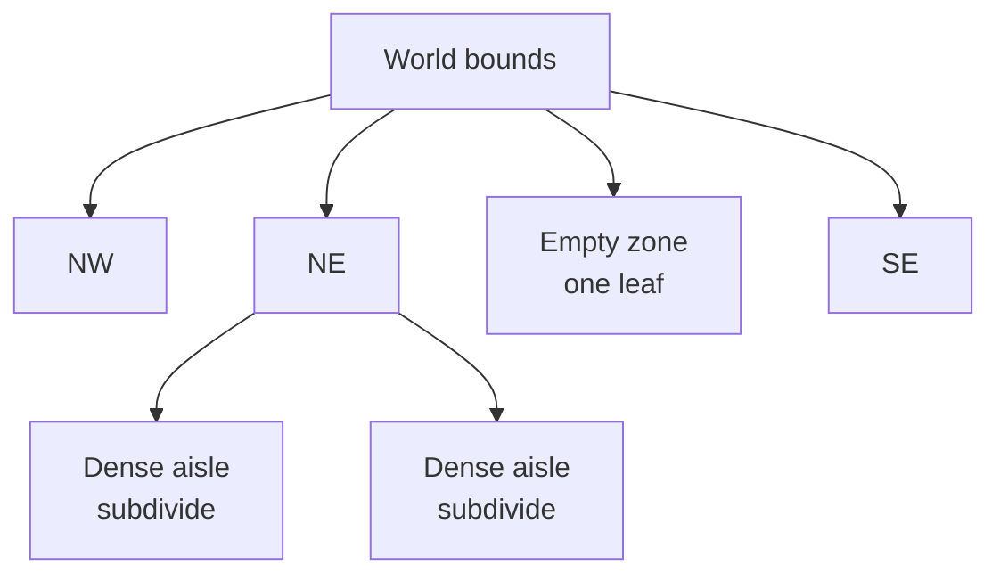
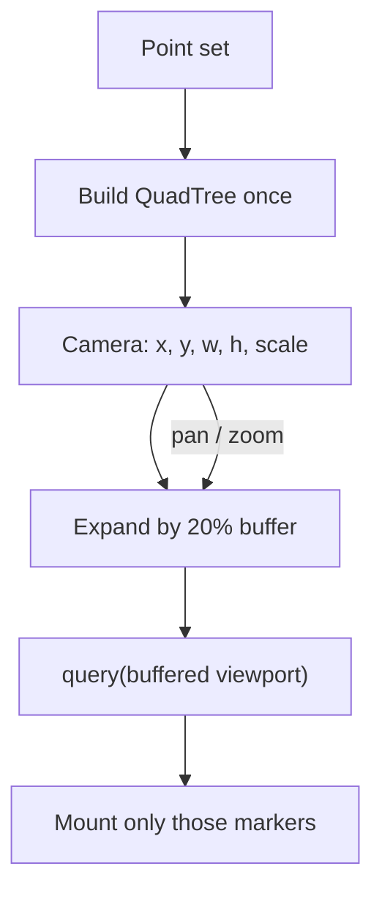

A warehouse map is a worst-case scatter plot. Thousands of robots, stations, and inventory points sit in tight clusters along aisles, with huge empty rectangles in between. If React mounts a marker for every point, the first paint is slow and every pan or zoom is worse — you pay O(n) on a frame that should feel like a map.

I put a QuadTree under the manager-dashboard map so the UI only mounted what the current viewport needed. Load time and interaction cost dropped by 5×. The same algorithm is in a public visualizer, stripped of internal data: [live demo](https://shiv4nk4r.github.io/react-quad-tree-map-visualizer/) and [source](https://github.com/shiv4nk4r/react-quad-tree-map-visualizer). The case study is under Work: [Manager dashboard / QuadTree](/work/quadtree-dashboard).

## The cost of a busy floor

A naive map does this on every camera change:

That is fine for a few hundred pins. On a live warehouse it is not. The tree of DOM/SVG nodes tracks the whole building, not the screen. Zooming into one aisle still diffs thousands of off-screen markers. Interaction time tracks world size, not what the operator is looking at.

The floor also refuses to be uniform. Pick faces and charger banks are dense; travel lanes and empty zones are not. A grid that is fine in a dense bay is wasted work in an empty quadrant. You want a structure that subdivides where the points actually are.

## Index the world, query the camera

A QuadTree recursively splits a rectangle into four children when a node holds more than a capacity of points (here, four). Dense clusters go deep. Empty warehouse space stays as a few large leaves. Insert is a walk from the root. A viewport query skips any node whose bounds miss the camera.

Build happens when the point set changes, not on every frame. Each pan or zoom is a range query plus a React render of the hit list.

The 20% buffer is the difference between a cheap query and a stutter. Without it, a fast pan pops markers in at the edge. With it, the next strip of aisle is already in the tree. Query stays O(log n) plus the size of the visible set — which on a zoomed aisle is tens or hundreds of points, not thousands.

Bypass mode in the visualizer turns the index off and mounts everything. On 10,000 elements that is about 5–15 FPS. With the tree it holds 60 FPS. Same data, same React renderer; the only change is what enters the tree of components.

## What I measured

| Path | What you pay | On a busy map |
| --- | --- | --- |
| Brute force | O(n) markers every frame | First paint and every pan track the whole warehouse |
| QuadTree + viewport | O(log n) query + O(visible) mounts | Paint tracks the aisle you are looking at |

On the production dashboard, load time and interaction cost improved by 5×. That is the number that mattered on the floor: the map opened, and dragging it did not freeze the rest of the manager UI.

The public visualizer reports the same internals I used to tune the production path: FPS, frame time, query time, quadtree build time, visible vs total items. You can toggle the tree overlay to see partitions tighten over clusters and stay coarse over empty space.

## Why this holds up

The tree is a spatial fact about the warehouse, not a React trick. Capacity-4 subdivision follows density. Viewport + buffer follows the camera. React only sees a short list. Rebuild when the feed changes; query when the operator moves.

That split is what made a crowded warehouse map feel like a map instead of a spreadsheet of points.

## Tech

React, a QuadTree with rectangle range queries (capacity 4), viewport culling with a 20% pan buffer, and a performance monitor for FPS / query / render / build. The reusable piece is `GenericQuadtreeVisualization`: items, `getItemBounds`, `renderItem`, world bounds.
