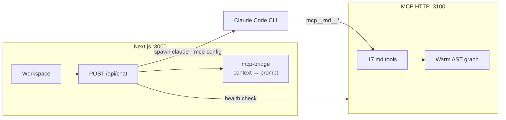
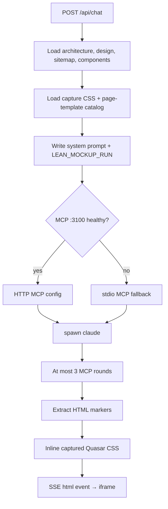
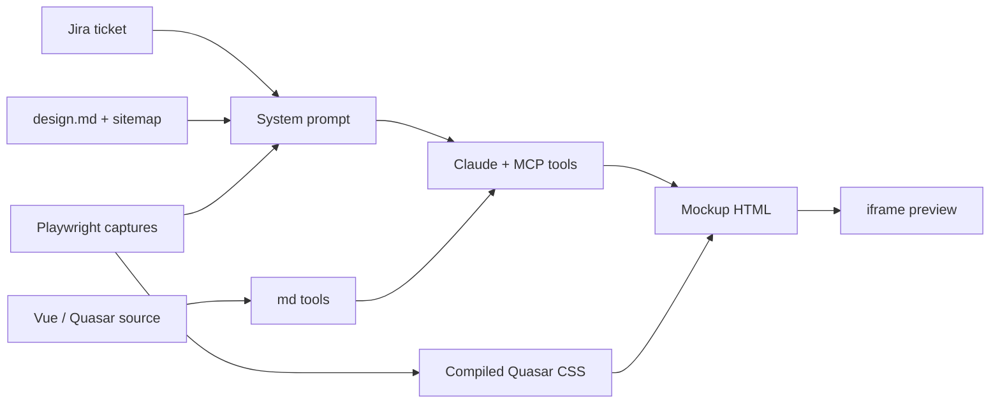
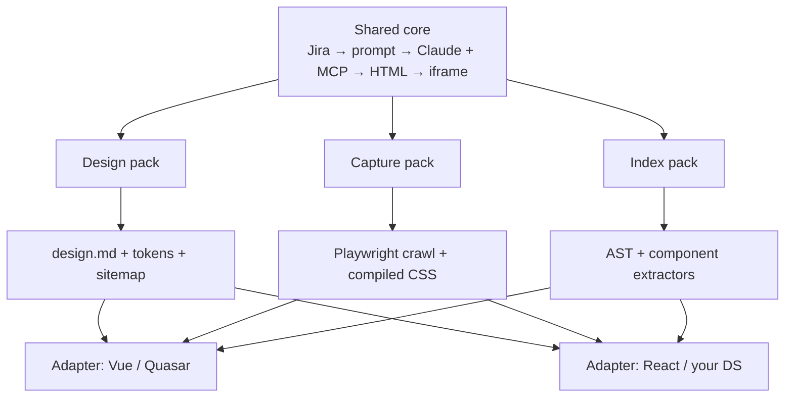

This is the write-up for an internal generator that turns a Jira ticket into a grounded UI mockup. The case study is under Work: [UI generation with AI workflows](/work/pm-orchestrator). Source: [ui-mock-JIRA-mcp](https://github.com/shiv4nk4r/ui-mock-JIRA-mcp).

## Problem

A Jira ticket would sit with a written spec, and a PM or designer still had to sketch the warehouse Manager Dashboard by hand before engineering started. Those sketches were slow, disconnected from the live Vue/Quasar codebase, and usually thrown away.

## Approach

The design is not “prompt an LLM for a screen.” It is a two-process system that grounds generation in whatever product you point it at: architecture and design-language docs in the system prompt, Playwright captures of live pages, and a persistent MCP server over that product’s source. Vue / Quasar is the first adapter, not the ceiling.

### Two processes

Next.js owns the workspace and the generation request. A separate Express MCP server on port 3100 keeps a warm AST graph of the Manager Dashboard and serves 17 codebase tools. Claude Code CLI attaches to that server at inference time. If `:3100` is down, the chat route falls back to a stdio MCP subprocess so generation still runs, just without a cached graph.

`mcp-bridge.ts` is only a server-side helper. It reads `context.md`, `design.md`, `site-map.md`, and the component library into strings and embeds them in the system prompt *before* Claude starts. Claude never calls those documents as tools. The tools it does call live in `src/mcp-http-server.ts`.

### Generation path

1. **Fetch the ticket**  
   Pull summary, description, comments, and attachments from Jira.

2. **Assemble the system prompt**  
   Product architecture, the Quasar design-language spec, sitemap, component library, the `LEAN_MOCKUP_RUN` contract, and a catalog of captured page templates.

3. **Spawn Claude**  
   `--allowedTools Write,Read,mcp__md__*` and stream SSE — `thinking`, `delta`, `html`, `done` — back to the browser.

4. **Ground the HTML**  
   After `RAW_HTML_COMPONENT_*` markers, inject captured CSS as `<style data-md-capture-css>` so the iframe matches production, not a CDN approximation.

The workspace is three phases: ticket gateway, generating, then chat plus an iframe preview. Refinements stay on the same ticket; each generation is a version you can jump back to.

### Design language

Mockups have to look like the Manager Dashboard, not like a generic admin theme. The source of truth is a strict Quasar v1 / Vue 2 design document that the model is not allowed to invent around.

- No raw `<button>` / `<input>` when a Quasar component exists.
- Default listing pages follow outbound v2: `q-card flat bordered`, inner `q-layout` with `view="hHh lpr fFf"`, `q-table` with `hide-pagination` and a separate footer bar.
- Toolbar is two rows (stats + utilities, then filter pills + search). Status chips use pastel hex backgrounds, not full-saturation Quasar color tokens.
- Page archetypes from captures: `listing-table`, `dashboard-tabs`, `form`, or `other`. Claude can ask for an archetype when no route matches the ticket.

A Playwright crawler (login once, then BFS) stores live HTML, compiled CSS, screenshots, and stripped DOM templates under `~/.pm-orchestrator/captures/`. Re-crawl only when the product UI moves. That is what makes “pixel-accurate” a property of the pipeline, not a hope about the model.

### Tool budget

Without a cap, the model would keep reading files. `LEAN_MOCKUP_RUN` limits it to three MCP rounds, then it must write HTML.

| Round | Allowed |
| --- | --- |
| 1 | `get-page-template` (visual) or `find-related-context` (code) |
| 2 | Related context, or `read-source-file` if a file was truncated |
| 3 | Last lookup, then build |

The HTTP MCP process keeps the AST graph warm across requests (Babel for `.ts`/`.js`, Vue SFC surface for `.vue`, disk cache with a 24-hour TTL). First generation can proceed while indexing finishes; graph tools say “not ready” and Claude falls back to filesystem reads.

The 17 tools cover routes, Vue components, GraphQL, Vuex, BFF resolvers, symbol search, callers, captured pages, and page templates. Claude is not browsing the repo as a chat user — it is querying a code graph built for this product.

### Not locked to Vue / Quasar

The first ship targeted the live Manager Dashboard because that is where the tickets lived. The pipeline itself is stack-agnostic: Jira in, grounded HTML out. Vue, Quasar, GraphQL, and Vuex sit behind three replaceable adapters.

| Adapter | What you swap | What you keep |
| --- | --- | --- |
| Design pack | `design.md`, tokens, sitemap, component library | System-prompt injection via `mcp-bridge` |
| Capture pack | Crawl URL, login, CSS bundle, page archetypes | Playwright BFS store + CSS inlining |
| Index pack | Vue SFC extractor → React/Svelte/Angular visitor | Warm graph, search, callers, `read-source-file` |
| Ticket source | Jira today | Same `/api/chat` contract |

A second product is a new `MD_REPO_ROOT` (or equivalent), a new design document the model cannot invent around, and a recrawl of that app’s live CSS. The workspace, SSE stream, LEAN tool budget, and HTTP-or-stdio MCP process stay. That is how you scale from one warehouse dashboard to any internal tool that already has a design system and a repo.

### Why Haiku is enough

Pixel-perfect here is a property of the pipeline, not of a frontier model. The design pack already named every Quasar component, spacing rule, and chip color. Captures already supplied the live DOM and the compiled CSS that gets inlined into the iframe. The MCP graph already pointed at the right Vue files. Haiku’s job is to assemble a screen from those constraints, not invent a design system.

That is also why a generation stays cheap. `LEAN_MOCKUP_RUN` caps the model at three tool rounds, then it must write HTML. No screenshot-in-the-loop, no long chat, no rereading `design.md` as tools. On Haiku, one iteration landed under $0.10 and still matched the live dashboard.

## Outcome

Ticket to a pixel-accurate UI mockup in about 90 seconds, replacing the manual sketch step. I ran this on a normal Haiku model: one iteration cost less than $0.10 because fidelity comes from grounding and the tool budget, not from spending more tokens. The same loop holds for the next stack.

## Tech

Next.js, TypeScript, an LLM, MCP, Playwright captures, and a swappable design-system adapter.
