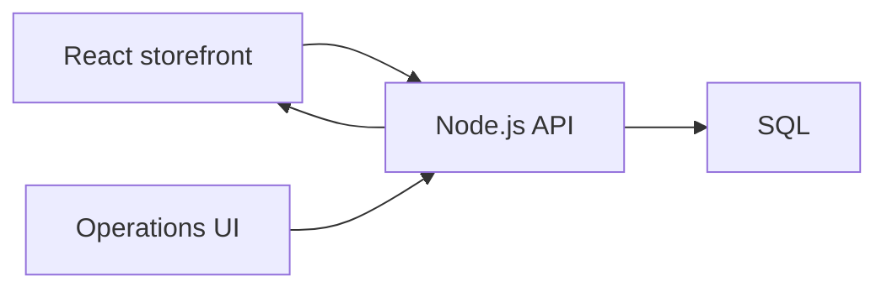
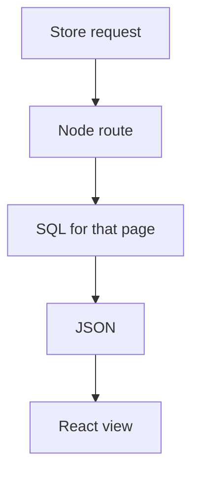

Visit Health needed the pharmacy to sell, not to advertise. Catalog, checkout, and the operations behind a fill had to live in the same product as the rest of the health app. I built and extended that store as a full-stack developer: Node.js APIs, SQL as the source of truth, React for the storefront.

Features that shipped with this work contributed to a 50% boost in user engagement. Backend work cut server response time by 20%. The case study is under Work: [Visit Health pharmacy](/work/visit-health-pharmacy).

## A store, not a brochure

A brochure page can list SKUs. A pharmacy store has to take money, reserve stock, and stay consistent when two people hit the same SKU. That is three surfaces on one stack:

1. **Catalog**  
   Browse and search what can actually be sold, with prices and availability from the database, not a static list.

2. **Checkout**  
   Cart, order, and payment against the same records the warehouse and pharmacy staff see.

3. **Operations**  
   The work after the click: what was ordered, what is left, what still needs to be fulfilled.

React owned the interactive store. Node owned the contract. SQL owned stock and orders so the storefront and ops could not drift.

## Where the time went

Engagement dies if the catalog stutters. I treated the hot path as catalog and checkout reads, not as a generic “make the API faster.”

The 20% drop in server response time came from tightening that path — fewer round trips, queries that matched how the store actually listed and checked out, less work on the request before React could paint. The 50% engagement lift sat on features that made the store usable as a store: you could find a product and finish an order without leaving the app.

## What I would still keep

Keep one database for catalog and orders. Keep the API as the only writer. Keep the storefront thin. A pharmacy store fails in obvious ways when those three disagree — double sells, stale prices, a checkout that does not match the shelf.

Node.js, SQL, and React were enough. The constraint was the product, not the framework.

## Tech

Node.js, SQL, and React.
